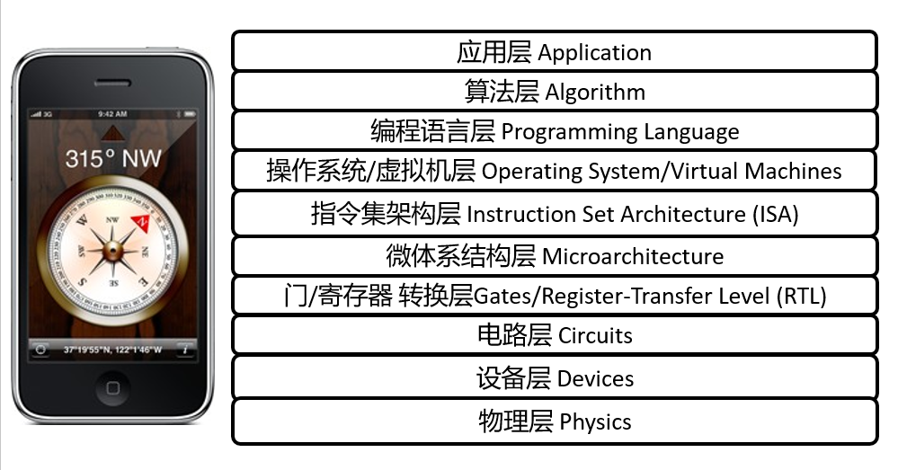
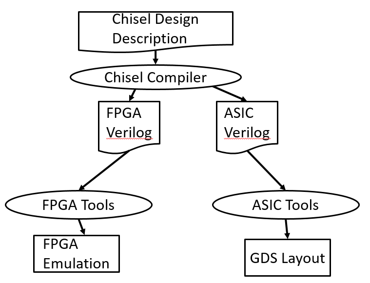

## 

# L01-Introduction

## 1，什么是计算机架构（Computer Architecture)

计算机架构抽象层的设计（design of the abstraction layers），允许我们通过可用的制造技术，来高效地实现信息处理的应用。

## 2， 现代系统中的抽象层

比如，智能手机打开一个指南针应用，它的各个层级自下而上为：

# 3，RISC-V是什么

RISC-V是伯克利Berkeley大学为了教学和研究和开发的一种，新的、免费的、简单的、干净的、可扩展的ISA（指令集架构）。关于RISC-V的由来可参考：[History - RISC-V International (riscv.org)](https://riscv.org/about/history/)。

- 全世界对RISC-V感兴趣并不是因为它是一种伟大的新芯片技术，而是因为它是一种通用的**免费**开放标准，它允许任何人自由地开发自己的硬件来运行该软件。RISC-V International不管理或提供任何开源的RISC-V实现，只提供标准规范。RISC-V软件由各自的开源软件项目管理。

- 两种主流的ISA (x86和ARM)都过于复杂，无法用于教学或研究

- RISC-V已经商业化

- 现在已实现对许多工具的上游支持，如gcc, Linux, FreeBSD，…

- 英伟达在未来的所有gpu中都使用RISC-V

- 三星，高通，谷歌，很多其他公司都使用RISC-V

## 4， Chisel是什么

Chisel也是伯克利大学基于Scala开发的一种新的硬件描述语言，和RISC-V一样，也是由Parlab实验室开发的。

>  Chisel：**C**onstructing **H**ardware **i**n a **S**cala **E**mbedded **L**anguage

Chisel的设计流程图：

## 5，IBM360 - 使用通用寄存器的机器

寄存器状态：

- 16个32bit的通用寄存器

- 4个64bit的浮点计数器

- 1个程序状态字（Program Status Word，PSW）

- 1个24位地址的32-bit机器

- 数据格式：
  
  - 一个字节byte：8 bits
  
  - half-word: 16 bits
  
  - word : 32 bits
  
  - double words : 64bits

正是从IBM360开始，才确认了一个字节为8个比特。
